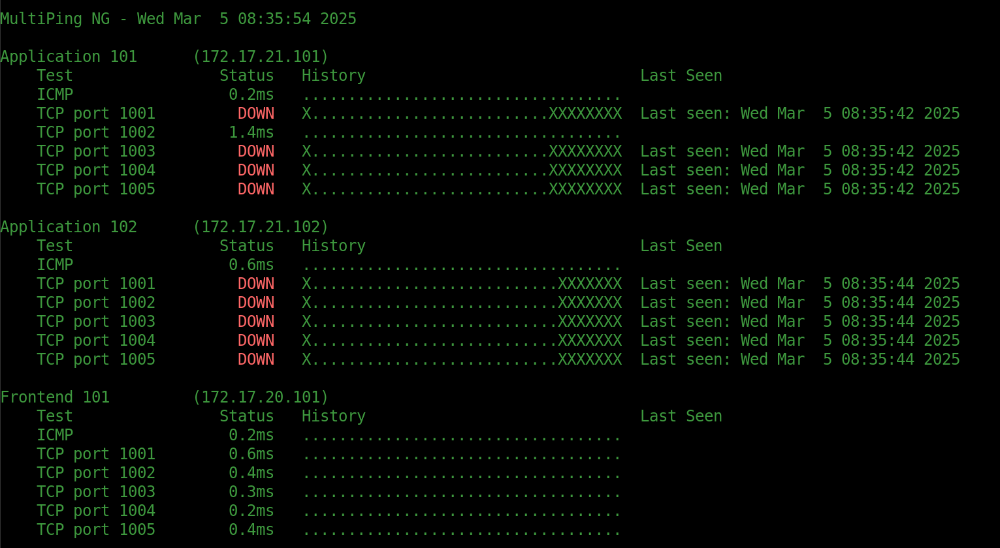

# MultiPing NG

MultiPing NG is a Python-based network monitoring tool that continuously checks the connectivity of multiple hosts. It performs both ICMP (ping) tests and TCP port tests concurrently, then displays the results in a live-updating, color-coded terminal dashboard.



## Features

- **Concurrent Testing:** Uses a thread pool to run multiple network tests in parallel.
- **ICMP and TCP Tests:** Supports both ping tests (ICMP) and TCP port connection tests.
- **Customizable Test History:** Maintains a fixed-length history of test results to visualize performance over time.
- **Live Terminal Dashboard:** Clears and updates the terminal screen continuously with real-time test statuses.
- **Color-Coded Output:** Utilizes ANSI escape sequences to highlight statuses (e.g., red for DOWN, yellow for slow responses).

## Requirements

- **Python 3**  
- **PyYAML:** For parsing the YAML configuration file. Install using pip:

  ```bash
  pip install pyyaml
  ```

- **Standard Libraries:** The script uses modules such as `sys`, `os`, `socket`, `time`, `subprocess`, `re`, `ipaddress`, and `concurrent.futures` which are included in the Python standard library.

## Usage

1. **Prepare the Configuration File:**  
   Create a YAML file (e.g., `config.yaml`) that specifies the hosts and tests. A sample configuration might look like this:

   ```yaml
   hosts:
     - "192.168.1.1":
         description: "Router"
         tests:
           - protocol: "ICMP"
     - "192.168.1.100":
         description: "Web Server"
         tests:
           - protocol: "TCP"
             port: 80
           - protocol: "TCP"
             port: "8000-8002"
   ```

   In this example, the script will:
   - Ping the host at `192.168.1.1`.
   - For the host at `192.168.1.100`, perform a TCP connection test on port 80 and a range of ports from 8000 to 8002.

2. **Run the Script:**  
   Ensure the script is executable. You can set the executable permission with:

   ```bash
   chmod +x new_pinger.py
   ```

   Then run the script with the configuration file as an argument:

   ```bash
   ./new_pinger.py config.yaml
   ```

   The script will continuously update the terminal with the latest network test results.

## How It Works

1. **Configuration Loading:**  
   The script reads a YAML configuration file to load host details and test parameters. Each host must be provided with a valid IP address and an optional description. If no test is defined, it defaults to an ICMP test.

2. **Testing Logic:**  
   - **ICMP Tests:** Uses the system's `ping` command with a 1-second timeout to determine if a host is reachable and measures the average round-trip time.
   - **TCP Tests:** Attempts to create a socket connection to the specified port(s) with a short timeout. The latency is calculated based on the connection time.
   - Both tests update a history array with symbols representing the status (e.g., a dot for success or an "X" for failure).

3. **Display:**  
   The results for each host and each test are displayed in organized columns showing:
   - Test type (ICMP or TCP with port)
   - Current status (latency or DOWN)
   - A history chart representing recent test results
   - A timestamp for the last time the host was seen as up

4. **Continuous Monitoring:**  
   The script loops indefinitely, updating the test results every second, and cycling through the history index to maintain a fixed-length record of recent statuses.

## Limitations

- **System Dependencies:** The script relies on the availability of the `ping` command and appropriate permissions to execute it.
- **ICMP Restrictions:** Some systems or networks may block ICMP traffic, which could affect test results.
- **Timeout Settings:** The short timeout values (0.5 seconds) may not be suitable for all network environments; adjust as necessary.

## Contributing

Feel free to fork the repository, submit issues, or propose improvements via pull requests. Contributions that enhance functionality, stability, or documentation are welcome.

## License

See the [LICENSE](LICENSE) file for more details.